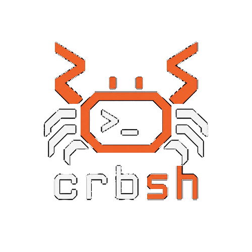

<p align="center"></p>

`crbsh` is a modern experimental Unix shell written in Rust. It executes
traditional programs directly through `$PATH`, owns its process pipelines, and
adds typed values, whole-script static checking, and structured data without
giving up Unix interoperability.

It is not a Bash clone and does not pass user input through Bash, Zsh, Fish, or
`/bin/sh`.

> `crbsh` is early-stage software. It is useful for development and
> experimentation, but it is not ready to replace a production login shell.

## What the Shell Can Do

### Run Unix programs directly

Commands resolve through `$PATH` and receive arguments without constructing a
secondary shell command string:

```crb
ls -la
git status
cargo test
nvim README.md
docker ps
```

Exit status is preserved and exposed as `status` for later commands and native
expressions.

### Build text pipelines

`crbsh` creates processes and wires their standard streams with Rust's
`Command` and `Stdio` APIs:

```crb
printf 'crab\nfish\n' | grep crab
cat README.md | grep crbsh | sort
```

Quoted and escaped pipes remain ordinary argument content:

```crb
print "hello | crab"
print hello\ world
```

### Redirect input and output

```crb
grep crab < input.txt
printf 'crab\n' > output.txt
printf 'shell\n' >> output.txt
cat input.txt | grep crab > matches.txt
```

Output redirection may overwrite with `>` or append with `>>`.

### Chain commands by exit status

```crb
cargo build && print "build passed"
false || print "command failed"
```

`&&` runs the next pipeline after success. `||` runs it after failure. Mixed
chains execute from left to right using the most recently executed pipeline's
status.

### Run and foreground background jobs

Add `&` to an external command or text pipeline:

```crb
sleep 10 &
printf 'crab\n' | grep crab &
```

Inspect and foreground jobs with builtins:

```crb
jobs
fg 1
```

`fg` without an ID selects the most recent running job. Foregrounding waits for
the job and makes its exit code the shell's current status.

### Maintain shell state

Commands that must modify the parent process are native builtins:

```crb
cd /path/to/project
cd
exit
exit 2
```

`cd` without a path uses `$HOME`.

Native variables can be inspected with `set`, exported to child processes, and
removed:

```crb
let project = "crbsh"
set
set project
export project
unset project
```

Environment overrides can be set without mutating the parent process's global
environment and are inherited by external commands:

```crb
export RUST_LOG = "debug"
env.RUST_BACKTRACE = "1"
unset env.RUST_LOG
unset @RUST_BACKTRACE
```

### Define command aliases

Aliases expand only in command position, may include fixed arguments, and are
checked for expansion cycles:

```crb
alias ll = "ls -la"
ll
alias ll
alias
unalias ll
```

Alias replacements are intentionally limited to a single command without
redirection. Arguments supplied at invocation are appended to the replacement.

### Persist interactive history

```crb
history
history 10
```

History suppresses consecutive duplicates and preserves multiline entries as
one logical item. It is stored at:

- `$XDG_STATE_HOME/crbsh/history` when `XDG_STATE_HOME` is set;
- `~/.local/state/crbsh/history` otherwise.

### Load startup configuration

Interactive shells load `~/.crbshrc` when it exists. The file runs through the
same parser and evaluator as normal `.crb` scripts, so aliases, variables, and
environment overrides become part of the interactive shell state.

### Run Crab scripts

Pass a `.crb` file to execute it in one persistent shell state:

```sh
cargo run -p crbsh -- path/to/script.crb
```

Other file extensions are rejected. Scripts can combine Unix commands with
typed variables, functions, conditions, loops, matching, and structured
pipelines. See the [Crab language guide](docs/language.md).

### Reject invalid files before side effects

Before executing a `.crb` script or `~/.crbshrc`, `crbsh` parses and type checks
the complete file. Invalid files are rejected before any command runs or any
file, shell-state, or environment side effect occurs.

The checker reports multiple independent diagnostics together with source
locations. It validates:

- declarations, assignments, operators, indexes, and known record fields;
- function arguments, return values, recursion, and fallthrough paths;
- boolean conditions, loop iterables, ranges, and match compatibility;
- shell-provided types for `status`, environment values, and native structured
  stages.

Ordinary Unix commands remain dynamically bounded: `crbsh` does not pretend to
know the private argument or output contracts of arbitrary external programs.
Interactive REPL input is still parsed and evaluated one complete input at a
time rather than preflight-checking a future session.

### Mix structured values with Unix tools

Native stages exchange typed values, while `crbsh` adapts data at Unix process
boundaries:

```crb
values ["crab", "fish"] | grep crab | collect
# [crab]

record name "Tony" active true | count
# 1
```

The language library owns native `ValueStream` transformations. The shell owns
text encoding, process input/output, redirection, errors, and final rendering.
The full model is documented in [Structured pipelines](docs/language.md#structured-pipelines).

## Builtins

| Builtin | Current behavior |
| --- | --- |
| `alias` | List, inspect, or define command-position aliases. |
| `cd` | Change the shell process's working directory. |
| `exit` | Exit with an optional numeric status. |
| `export` | Export a native variable or set an environment override. |
| `fg` | Foreground a running job by ID or select the latest job. |
| `history` | Print all or the most recent `N` history entries. |
| `jobs` | List running and completed background jobs. |
| `print` | Print resolved arguments separated by spaces. |
| `set` | List native variables or inspect one variable. |
| `unalias` | Remove an alias. |
| `unset` | Remove a native variable or environment override. |

Stateful builtins run only as standalone commands. They are rejected inside
multi-stage pipelines because a child process cannot safely mutate parent shell
state.

## Process Operators

| Operator | Meaning |
| --- | --- |
| `|` | Connect pipeline stages. |
| `&&` | Continue after a successful pipeline. |
| `||` | Continue after a failed pipeline. |
| `<` | Redirect standard input. |
| `>` | Redirect standard output, replacing the file. |
| `>>` | Redirect standard output, appending to the file. |
| trailing `&` | Run an external command or text pipeline in the background. |

## Install

Requirements:

- Rust 1.88 or newer
- Cargo
- a Unix-like environment
- `make` for the convenience targets

Build and run from source:

```sh
cargo build --workspace
cargo run -p crbsh
```

Install the release binary to `/usr/local/bin/crbsh`:

```sh
make install
```

Override the installation prefix when needed:

```sh
make install PREFIX="$HOME/.local"
make uninstall PREFIX="$HOME/.local"
```

## Development

The repository contains two Cargo packages:

```text
crbsh/
├── Cargo.toml
├── crates/
│   └── crab-lang/        # parser, AST, types, static checker, runtime values
├── docs/
│   └── language.md       # language reference and examples
└── src/
    ├── main.rs           # REPL, scripts, startup configuration
    ├── static_check.rs   # whole-file validation before execution
    ├── shell.rs          # persistent shell and host state
    ├── runtime/          # host evaluator
    ├── execution/        # processes, pipelines, adapters, jobs, redirection
    └── builtins/         # stateful shell commands
```

Run the complete project gate:

```sh
make ci
```

Equivalent commands:

```sh
cargo fmt --check
cargo check --workspace
cargo test --workspace
cargo clippy --workspace --all-targets --all-features -- -D warnings
```

## Current Limitations

- `crbsh` is not POSIX-compatible or a drop-in replacement for existing shells.
- Shell and language syntax may change while the project is young.
- Stateful builtins cannot participate in multi-stage pipelines.
- Structured pipelines cannot run as background jobs.
- Structured streams are buffered rather than lazy or backpressured.
- Interactive continuation primarily uses brace balance rather than a complete
  parser-level complete/incomplete/invalid model.
- Job control currently tracks and foregrounds child processes but is not yet a
  full terminal process-group implementation.

## Language Documentation

The language reference now lives in [docs/language.md](docs/language.md),
including values, types, expressions, lexical scoping, control flow, functions,
recursion, matching, command grammar, and structured pipelines.
